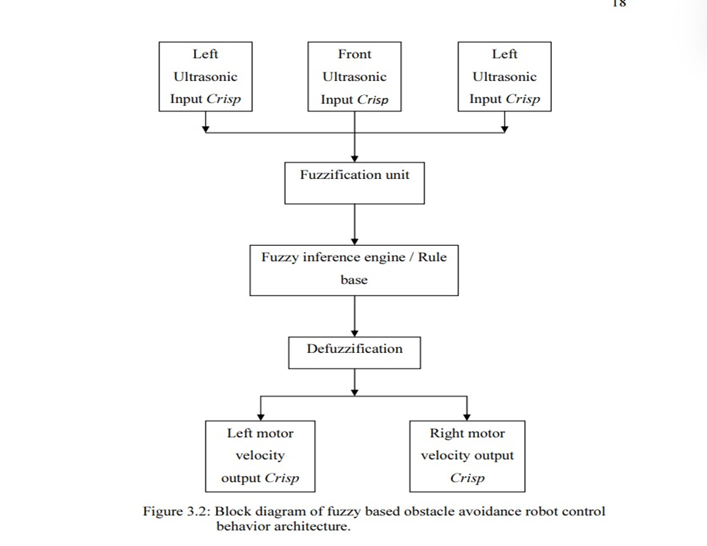
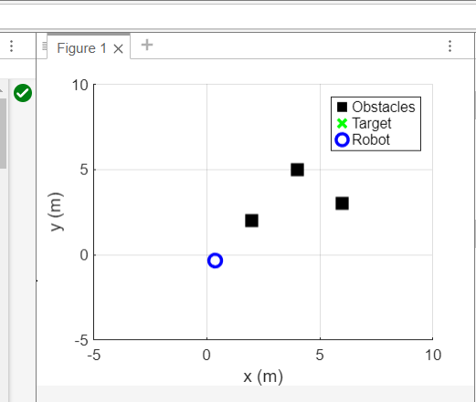
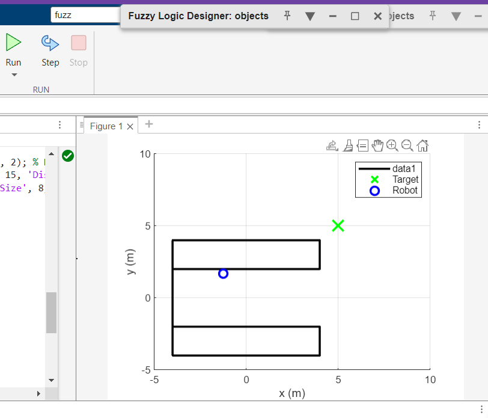

# 🤖 Obstacle Avoidance & Path Planning Robot using Fuzzy Logic (MATLAB)

## 📌 Overview
This project presents the design and simulation of an intelligent obstacle avoidance and path planning robot using a **Fuzzy Logic Controller (FLC)** in MATLAB.  
The system enables autonomous navigation by processing sensor inputs and making real-time decisions under uncertain and dynamic conditions.

By leveraging fuzzy logic, the robot achieves smooth, adaptive, and human-like decision-making, improving its ability to operate in complex environments.

---

## 🎯 Objectives
- Develop an intelligent navigation system using fuzzy logic  
- Enable real-time obstacle avoidance  
- Achieve smooth and adaptive robot movement  
- Simulate and analyze performance in MATLAB environment  

---

## ⚙️ Tools & Technologies
- MATLAB  
- Fuzzy Logic Toolbox  
- Proximity Sensors (Ultrasonic / IR - simulated)  

---
## 📷 Flowchart

---
## 🧠 System Architecture

### 1. Sensor Data Acquisition
The robot collects distance data from obstacles using simulated proximity sensors placed at different directions (front, left, right).  
These values are used as inputs to the fuzzy logic system.

### 2. Fuzzification
Crisp sensor inputs are converted into linguistic variables:
- Near  
- Medium  
- Far  

This step allows the system to handle uncertainty and imprecision effectively.

### 3. Fuzzy Inference System (FIS)
The FIS applies a rule-based decision-making approach using predefined IF-THEN rules.

**Sample Rules:**
- IF Front is Near → Turn  
- IF Right is Near → Turn Left  
- IF Left is Near → Turn Right  

### 4. Defuzzification
The fuzzy outputs are converted into crisp control signals such as:
- Steering direction  
- Movement control (Left / Right / Forward)  

---

## 📊 Output
 

---

## 💻 Code
The MATLAB implementation is available in the `code/` directory:
